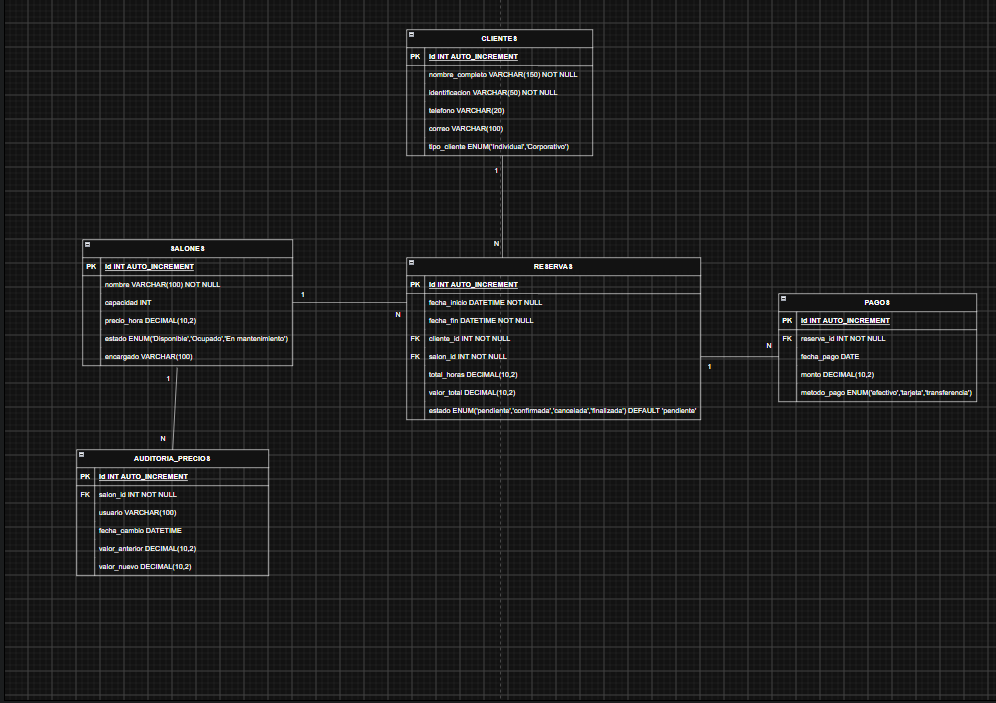

# Sistema de Reservas de Salones de Eventos

## Descripción del proyecto

Este proyecto consiste en el diseño y desarrollo de una base de datos para **Eventos Premier S.A.S.**, una empresa dedicada al alquiler de salones para reuniones, fiestas y conferencias.

El sistema permite gestionar la información de clientes, salones, reservas y pagos, además de controlar la disponibilidad de los salones y registrar los cambios realizados en sus precios.

La base de datos implementa **funciones SQL, triggers, vistas y consultas** para automatizar procesos y facilitar la gestión de las reservas.

---

## Estructura del proyecto

```text
Sistema-Reservas-Salones/
│
├── 01_creacion.sql
├── 02_funciones.sql
├── 03_triggers.sql
├── 04_consultas.sql
├── Diagrama_sql.png
└── README.md
```

---

## 01_creacion.sql

Contiene la creación de la base de datos y sus tablas:

- clientes
- salones
- reservas
- pagos
- auditoria_precios

También incluye:

- Llaves primarias.
- Llaves foráneas.
- Relaciones entre las tablas.
- Tipos de datos y restricciones (incluye `UNIQUE` en `identificacion` y `correo` de clientes, para evitar registros duplicados).
- Datos iniciales para realizar pruebas.

---

## 02_funciones.sql

Contiene las funciones personalizadas requeridas para el sistema.

### calcular_total_reserva()

Calcula el valor total de una reserva aplicando el 19% de IVA.

Ejemplo:

```sql
SELECT calcular_total_reserva(150000, 4) AS valor_total;
```

Resultado esperado:

```
714000.00
```

### verificar_disponibilidad()

Verifica si un salón se encuentra disponible durante un rango determinado de fecha y hora.

Retorna:

- `1` si el salón está disponible.
- `0` si el salón está ocupado.

Ejemplo:

```sql
SELECT verificar_disponibilidad(
    1,
    '2026-08-20 10:00:00',
    '2026-08-20 14:00:00'
) AS disponible;
```

---

## 03_triggers.sql

Contiene los triggers utilizados para automatizar procesos del sistema.

### actualizar_estado_salon_trigger

Se ejecuta al registrar una nueva reserva.

Permite:

- Verificar la disponibilidad del salón.
- Calcular automáticamente el total de horas.
- Calcular automáticamente el valor total de la reserva.
- Aplicar el IVA mediante la función correspondiente.
- Cambiar el estado del salón a `Ocupado`.

### liberar_salon_trigger

Se ejecuta al eliminar una reserva. Antes de liberar el salón, verifica que no queden otras reservas activas (`estado <> 'cancelada'`) asociadas a ese salón; solo si no quedan, cambia su estado a `Disponible`. Esto evita que un salón con varias reservas activas se marque como libre por error al borrar solo una de ellas.

### liberar_salon_cancelacion_trigger

Se ejecuta al actualizar una reserva y su `estado` cambia a `'cancelada'`. Aplica la misma verificación que `liberar_salon_trigger`: solo libera el salón si no quedan otras reservas activas. Cubre el caso de cancelación (muy común en un sistema de reservas real) además del caso de eliminación.

### auditoria_precios_trigger

Se ejecuta cuando se modifica el precio por hora de un salón y registra:

- Salón afectado.
- Usuario que realizó el cambio.
- Fecha del cambio.
- Valor anterior.
- Valor nuevo.

---

## 04_consultas.sql

Contiene las consultas y la vista solicitadas para el sistema.

### Reservas en un rango de fechas

Consulta las reservas realizadas entre dos fechas utilizando `BETWEEN`.

### Salones disponibles

Muestra los salones que superan una capacidad determinada y cuyo estado sea `Disponible`.

### Clientes corporativos

Identifica los clientes de tipo `Corporativo` que hayan realizado más de 3 reservas mediante `COUNT`.

### vista_resumen_reservas

Vista que muestra un resumen de las reservas incluyendo:

- Nombre del cliente.
- Nombre del salón.
- Fecha de inicio.
- Fecha de fin.
- Valor total.
- Estado de la reserva.

Ejemplo:

```sql
SELECT * FROM vista_resumen_reservas;
```

---

## Instrucciones de ejecución

### Requisitos

Se requiere:

- MySQL Server.
- Visual Studio Code.
- Extensión de MySQL para Visual Studio Code.

### Pasos de ejecución

**1. Crear la base de datos**

Ejecutar primero:

```
01_creacion.sql
```

Este archivo crea la base de datos, las tablas, las relaciones y los datos iniciales.

**2. Crear las funciones**

Ejecutar:

```
02_funciones.sql
```

Este archivo crea las funciones personalizadas del sistema.

**3. Crear los triggers**

Ejecutar:

```
03_triggers.sql
```

Este archivo crea los triggers de disponibilidad, cálculo automático y auditoría.

**4. Ejecutar las consultas**

Finalmente, ejecutar:

```
04_consultas.sql
```

Este archivo contiene la vista y las consultas requeridas.

> **Importante:** Los scripts deben ejecutarse en el orden indicado para garantizar que las tablas, funciones y triggers necesarios existan antes de utilizarlos.

---

## Ejemplos de funciones, triggers y consultas

### Función para calcular el total

```sql
SELECT calcular_total_reserva(150000, 4) AS valor_total;
```

### Función para verificar disponibilidad

```sql
SELECT verificar_disponibilidad(
    1,
    '2026-08-20 10:00:00',
    '2026-08-20 14:00:00'
) AS disponible;
```

### Consulta de reservas

```sql
SELECT *
FROM reservas
WHERE fecha_inicio BETWEEN '2026-08-20' AND '2026-08-30';
```

### Consulta de salones disponibles

```sql
SELECT *
FROM salones
WHERE capacidad > 100
AND estado = 'Disponible';
```

### Consulta de clientes corporativos

```sql
SELECT c.nombre_completo, COUNT(r.id) AS total_reservas
FROM clientes c
INNER JOIN reservas r
    ON c.id = r.cliente_id
WHERE c.tipo_cliente = 'Corporativo'
GROUP BY c.id, c.nombre_completo
HAVING COUNT(r.id) > 3;
```

### Consulta de la vista

```sql
SELECT * FROM vista_resumen_reservas;
```

### Ejemplo de trigger de auditoría

Al modificar el precio por hora de un salón, el trigger registra automáticamente el cambio:

```sql
UPDATE salones
SET precio_hora = 175000
WHERE id = 1;

SELECT * FROM auditoria_precios;
```

---

## Diagrama de la base de datos



---

## Créditos y autor

- **Autor:** Pedro Díaz
- **Proyecto:** Sistema de Reservas de Salones de Eventos
- **Tipo:** Proyecto académico de bases de datos

---

## Repositorio en GitHub

El repositorio contiene todos los scripts SQL, el diagrama de la base de datos y la documentación necesaria para ejecutar y comprender el proyecto.

La estructura del repositorio se encuentra organizada de la siguiente manera:

```
01_creacion.sql
02_funciones.sql
03_triggers.sql
04_consultas.sql
Diagrama_sql.png
README.md
```


# CAMBIOS IMPLEMENTADOS DEL EXAMEN

## 1. verificar_disponibilidad: Función que devuelve 1 o 0 según la disponibilidad

## 2. Consulta de pagos por transferencia: Utiliza JOIN, SUM, GROUP BY y ORDER BY y muestra el nombre del cliente, nombre del salon, metodo de pago, fecha de pago y monto pagado correctamente

## 3. vista_resumen_pagos: Vista construida mediante JOIN entre: pagos, reservas, clientes y salones.

## 4. auditoria_pagos: Tabla necesaria para almacenar el historial de nuevos pagos.

## 5. auditoria_pagos_trigger: Trigger AFTER INSERT que registra automáticamente: ID del pago, fecha, usuario y valor pagado.
